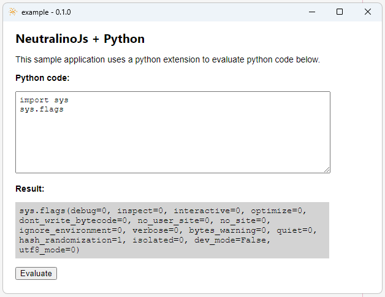

# neutrapy

A CLI tools to build desktop applications with [Neutralinojs][1] and Python as backend
<hr />

`neutrapy` maintains both the frontend and backend of the application and creates a universal configuration file for the application. You can use `neutrapy sync` to syncronize the configurations to `neutralino.config.json`, `pyproject.toml` and `<name>.bzl` for [`PyOxidizer`][3] to build the backend into a binary.

## Example



The example is generated by `neutrapy create -n example`. It isn't the same as the offical example, called [litePy][4], from Neutralinojs. The official one saves the code into a temporary file and executes it by spawn a python process each time the code is received. This one is implemented as a Neutralino extension written in Python and uses [websocket_client][5] to communicate with the Neutralino server.

## Installation

```bash
$ pip install -U neutrapy
# Installs the latest version of neutrapy
```

## Usage

### Checking the requirements

```bash
$ neutrapy check
# Checks if neu-cli, poetry and pyoxidizer are installed
```

### Creating a new project

```bash
$ neutrapy create -n <name>
# Creates a new project with the name <name>
```

### Syncronizing the configurations

```bash
$ neutrapy sync
# Syncronizes the configurations to neutralino.config.json, pyproject.toml and <name>.bzl
```

### Running the application

```bash
$ neutrapy run
# Runs the application
```

### Building the application

```bash
$ neutrapy build
# Builds the application
```

## Credits

- [neutralino_python_extension_sample][2]

[1]: https://neutralino.js.org/
[2]: https://github.com/danidre14/neutralino_python_extension_sample
[3]: https://github.com/indygreg/PyOxidizer
[4]: https://github.com/codezri/litepy
[5]: https://github.com/websocket-client/websocket-client
